# Statechart — Amplifier Masterclass (LOCKED)

**Locked:** 2026-04-08
**Status:** APPROVED — scroll-driven state machine for single-page scroll site

---

## Overview

This is a single-page scroll site. There is no routing. All state transitions are scroll-driven. The statechart captures:
1. Which section is the active scroll zone
2. Particle swarm state per section
3. Palette-break transitions (dark↔light)
4. The parallax reveal mechanism for dark→light transitions
5. Navigation chrome state

---

## Mermaid Statechart

```mermaid
stateDiagram-v2
    direction TB

    [*] --> S01_Introduction

    state "Dark Void Sections" as DarkVoid {
        state "S01 Introduction" as S01_Introduction
        state "S02 Architecture Map" as S02_ArchitectureMap
    }

    state "Palette Break 1" as PaletteBreak1 {
        state "S03 Design Philosophy" as S03_DesignPhilosophy
    }

    state "Technical Core (Dark)" as TechCore {
        state "S04 The Kernel" as S04_Kernel
        state "S05 Module System" as S05_ModuleSystem
        state "S06 The Orchestrator" as S06_Orchestrator
        state "S07 Tools vs Hooks" as S07_ToolsVsHooks
        state "S08 Sessions" as S08_Sessions
        state "S09 Bundles" as S09_Bundles
        state "S10 Foundation Bridge" as S10_FoundationBridge
        state "S11 Agents & Recipes" as S11_AgentsRecipes
    }

    state "Palette Break 2" as PaletteBreak2 {
        state "S12 Complete Picture" as S12_CompletePicture
    }

    state "Ending (Dark)" as Ending {
        state "S13 Appendix" as S13_Appendix
    }

    S01_Introduction --> S02_ArchitectureMap : scroll (conceptual→technical)
    S02_ArchitectureMap --> S03_DesignPhilosophy : PARALLAX REVEAL (dark→parchment)
    S03_DesignPhilosophy --> S04_Kernel : HARD CUT (parchment→dark)
    S04_Kernel --> S05_ModuleSystem : scroll (void→slate)
    S05_ModuleSystem --> S06_Orchestrator : scroll (slate→void)
    S06_Orchestrator --> S07_ToolsVsHooks : scroll (void→slate)
    S07_ToolsVsHooks --> S08_Sessions : scroll (slate→void)
    S08_Sessions --> S09_Bundles : scroll (void→slate)
    S09_Bundles --> S10_FoundationBridge : scroll (slate→void)
    S10_FoundationBridge --> S11_AgentsRecipes : scroll (void→slate)
    S11_AgentsRecipes --> S12_CompletePicture : PARALLAX REVEAL (dark→parchment)
    S12_CompletePicture --> S13_Appendix : HARD CUT (parchment→dark)
    S13_Appendix --> [*]
```



---

## Scroll State Machine

### Active Section Detection

The active section is determined by IntersectionObserver with `threshold: 0.3` — the section occupying ≥30% of the viewport is "active." This drives:
- Sidebar TOC active indicator
- Top nav section label
- Swarm behavior interpolation
- Background color (via section's CSS class)

### State Table: Section Properties

| Section | Background Class | Swarm Config Key | Entry Eyebrow Color | Glass Cards | Has Diagram |
|---------|-----------------|-----------------|--------------------:|:-----------:|:-----------:|
| S01 | `section--void` | `preFlock` | copper | No | No |
| S02 | `section--void` | `strata` | azure | No | Yes (D01) |
| S03 | `section--parchment` | `silence` | copper | No | No |
| S04 | `section--void` | `denseCore` | azure | Yes (5) | Yes (D02) |
| S05 | `section--slate` | `branching` | azure | Yes (6) | Yes (D03) |
| S06 | `section--void` | `vortex` | azure | No | Yes (D04) |
| S07 | `section--slate` | `bilateralSplit` | azure | No | Yes (D05) |
| S08 | `section--void` | `spawning` | azure | No | Yes (D06) |
| S09 | `section--slate` | `nestedRings` | azure | No | Yes (D07) |
| S10 | `section--void` | `bridge` | azure | No | Yes (D08) |
| S11 | `section--slate` | `convergence` | azure | Yes (2) | Yes (D09) |
| S12 | `section--parchment` | `silence` | copper | No | Yes (D10) |
| S13 | `section--void` | `fadingEmbers` | azure | No | No |

---

## Swarm State Machine

The particle swarm is a single `<canvas>` element at `position: fixed; z-index: -1`. Swarm behavior interpolates between section configurations based on scroll position.

### Swarm States

```mermaid
stateDiagram-v2
    direction LR

    [*] --> PreFlock : page load

    PreFlock --> Strata : S01→S02 (gradual alignment)
    Strata --> Silence : S02→S03 (dissolve over 75vh)
    Silence --> DenseCore : S03→S04 (reconstitute clustered, 50vh)
    DenseCore --> Branching : S04→S05 (core explodes outward)
    Branching --> Vortex : S05→S06 (streams curve into spiral — KEY TRANSITION)
    Vortex --> BilateralSplit : S06→S07 (vortex splits bilaterally)
    BilateralSplit --> Spawning : S07→S08 (schools merge, then bud)
    Spawning --> NestedRings : S08→S09 (tree reorganizes concentrically)
    NestedRings --> Bridge : S09→S10 (rings unfurl horizontally)
    Bridge --> Convergence : S10→S11 (bridge gathers inward)
    Convergence --> Silence2 : S11→S12 (compress, hold, scatter, dissolve)
    Silence2 --> FadingEmbers : S12→S13 (sparse return, minimal energy)
    FadingEmbers --> [*] : end of page
```



### Swarm Transition Parameters

| Transition | Interpolation Distance | Easing | Priority |
|-----------|----------------------|--------|----------|
| S01→S02 (PreFlock→Strata) | 100vh centered on boundary | ease-in-out | Normal |
| S02→S03 (Strata→Silence) | 75vh (final 75vh of S02) | ease-out | High — swarm dissolves BEFORE parallax reveal |
| S03→S04 (Silence→DenseCore) | 50vh (first 50vh of S04) | ease-in | Normal — fast reconstitution |
| S04→S05 (DenseCore→Branching) | 100vh | ease-in-out | High — explosive outward |
| **S05→S06 (Branching→Vortex)** | **200vh** | **ease-in-out** | **CRITICAL — the signature atmospheric transition** |
| S06→S07 (Vortex→BilateralSplit) | 100vh | ease-in-out | Normal |
| S07→S08 (BilateralSplit→Spawning) | 100vh | ease-in-out | Normal |
| S08→S09 (Spawning→NestedRings) | 100vh | ease-in-out | Normal |
| S09→S10 (NestedRings→Bridge) | 100vh | ease-in-out | Normal |
| S10→S11 (Bridge→Convergence) | 100vh | ease-in-out | Normal |
| S11→S12 (Convergence→Silence) | 75vh (final 75vh of S11) | ease-out | High — swarm completes journey then dissolves |
| S12→S13 (Silence→FadingEmbers) | 50vh (first 50vh of S13) | ease-in | Normal — sparse return |

---

## Parallax Reveal Mechanism (Dark → Parchment)

Applies to: S02→S03 and S11→S12.

### DOM Structure

```
<section class="section--void z-1 relative">   <!-- S02 or S11 -->
  ...content...
  <div class="void-gap h-[48-64px]" />          <!-- Pure darkness -->
</section>
<section class="section--parchment sticky top-0 z-0">  <!-- S03 or S12 -->
  ...content already rendered...
</section>
```

### Scroll Sequence (frame by frame)

| Scroll Position | What Happens | Swarm State |
|----------------|-------------|-------------|
| S02 body visible | Normal reading | Strata (full) |
| S02 UpNextTeaser enters | "Next: Design Philosophy" signals transition | Strata losing cohesion |
| S02 final 75vh | Particles drift apart, slow, fade | Dissolving (opacity → 0) |
| S02 void gap | Pure #0F0F13, no content, no particles | Zero |
| S02 scrolls off top | z-index: 1 section exits viewport | Zero |
| S03 revealed underneath | Parchment was always there (z-index: 0, sticky) | Silence |
| S03 content visible | Already rendered, no animation. Background change IS the event. | Silence |

### Hard Cut Mechanism (Parchment → Dark)

Applies to: S03→S04 and S12→S13.

No parallax. No overlap. Clean horizontal boundary. The parchment section ends; the dark section begins immediately. The swarm reconstitutes already organized (not scattered) over the first 50vh.

---

## Navigation Chrome State

### Top Nav

| Condition | State |
|-----------|-------|
| User scrolling down | Hidden (translate-Y off-screen, 250ms ease) |
| User scrolling up | Visible (translate-Y 0, 250ms ease) |
| Active section is parchment | Glass inverts: rgba(0,0,0,0.04), rgba(0,0,0,0.07) border |
| Active section is dark | Glass normal: rgba(255,255,255,0.04), rgba(255,255,255,0.07) border |

### Sidebar TOC

| Condition | State |
|-----------|-------|
| Active section is dark | Full opacity, active item in azure |
| Active section is parchment | Reduced opacity (0.3), still functional |
| Viewport < 1024px | Hidden; replaced by hamburger in top nav |

### Progress Bar

| Condition | State |
|-----------|-------|
| Always | Width = (scrollY / maxScroll) * 100% |
| Color | Always azure (#0082EB), 2px height |

---

## Content Reveal States

All content uses one-shot scroll-triggered reveals:

| Element | Animation | Trigger |
|---------|-----------|---------|
| Eyebrow | fade-in + 20px translate-up | Enter viewport (IntersectionObserver) |
| Headline | fade-in + 20px translate-up, 100ms delay | Enter viewport |
| Lead sentence | fade-in + 20px translate-up, 200ms delay | Enter viewport |
| Body paragraphs | fade-in + 20px translate-up | Enter viewport (sequential, staggered) |
| Diagrams | fade-in + 30px translate-up | Enter viewport |
| Glass cards | fade-in + 20px translate-up | Enter viewport (staggered per card) |

**Duration:** 800ms (`--duration-reveal`)
**Easing:** `--ease-settle` (smooth deceleration)
**Direction:** One-shot. No exit animations. Once revealed, content is permanent.
